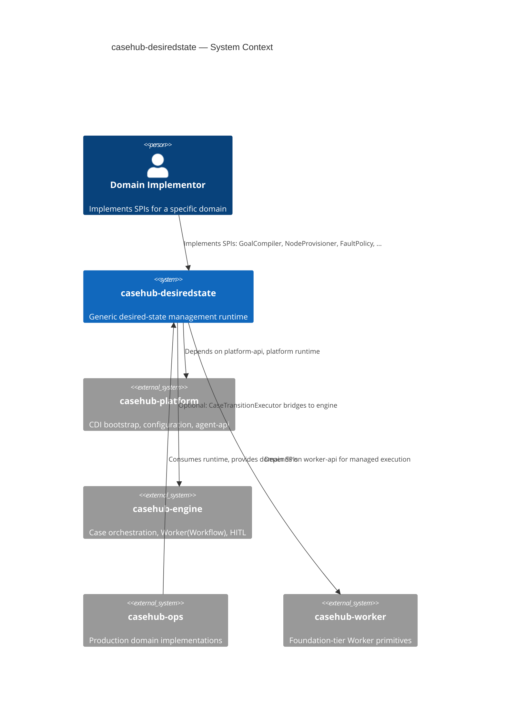
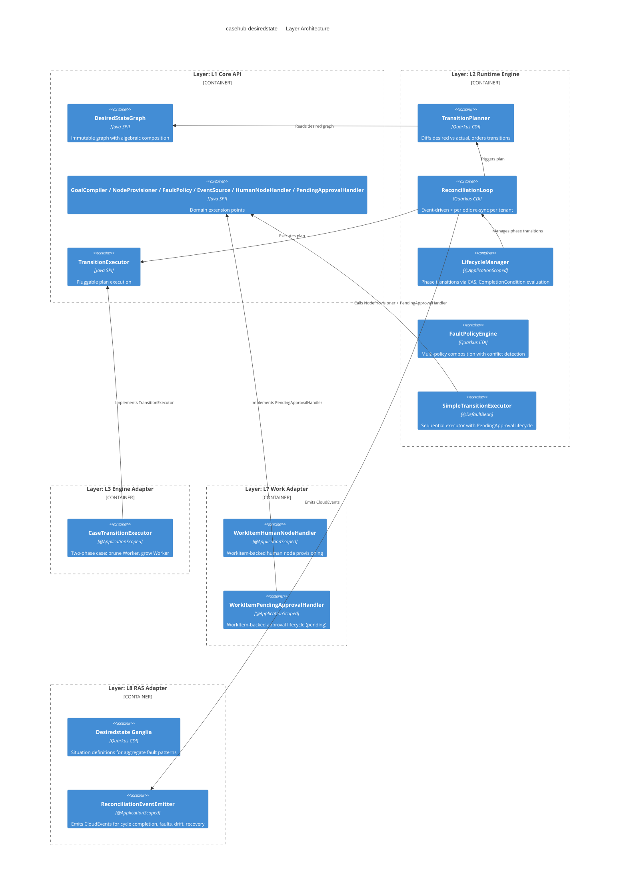
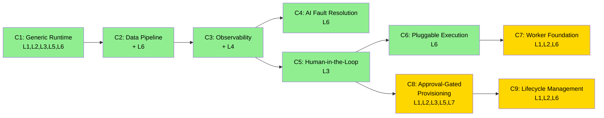

# casehub-desiredstate — ARC42STORIES.MD

**Spec:** Arc42Stories v0.1
**Profile:** CaseHub — Foundation tier
**Profile ref:** `../parent/docs/arc42stories-casehub-profile.md` · fallback: `https://raw.githubusercontent.com/casehubio/parent/main/docs/arc42stories-casehub-profile.md`
**Build position:** Foundation — depends on casehub-platform; before casehub-engine in build order
**Consumed by:** casehub-ops (future domain implementations)
**Depends on:** casehub-platform-api (api/), casehub-platform (runtime/), casehub-engine-api + casehub-engine-flow + casehub-work-api (engine-adapter/ only)

## Artifact Schema

| Artifact type | Format | Example | Where it lives |
|---|---|---|---|
| Issue | `#NNN` or `casehubio/[repo]#NNN` | `#28`, `casehubio/engine#528` | GitHub Issues |
| Garden entry | `GE-YYYYMMDD-XXXXXX` | `GE-20260521-e39ad1` | `~/.hortora/garden/` |
| ADR | `ADR-NNNN` | `ADR-0001` | `docs/adr/` |
| Blog entry | `YYYY-MM-DD-[initials]NN-title` | `2026-06-16-mdp01-the-pipeline-that-broke-the-runtime` | workspace `blog/` |
| Design spec | `YYYY-MM-DD-topic-design` | `2026-06-12-generic-runtime-design` | `docs/superpowers/specs/` |

---

## §1 Introduction and Goals

**Problem:** Desired-state management — declaring intent as a dependency graph, diffing against reality, planning transitions, executing them, and continuously reconciling — is a general pattern. Kubernetes, Terraform, Puppet, and Ansible each solve it for a fixed domain. CaseHub needs this pattern domain-agnostically: infrastructure provisioning, data pipelines, IoT fleet management, agent orchestration — same runtime, different SPIs.

**What this module provides:**
- Domain-agnostic desired-state runtime with pluggable SPIs
- Immutable dependency graph with algebraic composition (overlay/connect)
- Pruning-before-growing transition ordering (no dangling dependencies)
- Event-driven reconciliation loop with periodic re-sync
- Three-tier fault escalation (auto-retry → AI → human)
- Optional case-backed execution via casehub-engine bridge

**Stakeholders:**

| Stakeholder | Interest |
|---|---|
| Domain implementors | SPI contracts must be complete, composable, and minimal |
| CaseHub platform | Foundation-tier module — no upward dependencies |
| casehub-engine | Engine adapter provides case-backed durability and visualization |
| casehub-ops | Production domain implementations consume this runtime |

**Quality goals:**

| Priority | Goal | Measure |
|---|---|---|
| 1 | Domain agnosticity | Two structurally distinct domains (Dungeon, Pipeline) use identical runtime |
| 2 | SPI completeness | Every extension point a domain needs is an SPI, not a runtime change |
| 3 | Ordering correctness | Pruning before growing, leaves-first removal, roots-first addition |
| 4 | Fault composability | Multiple fault policies compose without shared state |

---

## §2 Constraints

| Constraint | Source | Impact |
|---|---|---|
| Foundation tier | CaseHub platform architecture | api/ and runtime/ depend only on casehub-platform; no upward deps to engine or work |
| Pure Java SPIs | Module-tier-structure protocol | api/ has zero CDI runtime deps — annotations only (provided scope) |
| Quarkus CDI | Platform standard | Runtime uses `@ApplicationScoped`, `@DefaultBean` for displacement |
| Immutable graphs | Design decision | Every mutation returns a new versioned graph; safe for concurrent reads |
| Mutiny reactive | Platform standard | TransitionExecutor returns `Uni<TransitionResult>`; EventSource returns `Multi<StateEvent>` |

---

## §3 Context and Scope



**Platform references:**
- `docs/PLATFORM.md` Cross-Repo Dependency Map — authoritative consumer list
- `docs/repos/casehub-desiredstate.md` — platform deep-dive (when created)

---

## §4 Solution Strategy

### Core patterns

| Pattern | Why chosen |
|---|---|
| SPI-driven architecture | Domains plug in without modifying the runtime; proven by structurally distinct examples |
| Immutable dependency graph | Concurrent reads during reconciliation without locks; versioned CAS for goal updates |
| Lifecycle phase transitions | Multi-phase desired states (build→defend, bronze→silver→gold) without re-invoking GoalCompiler; `CompilationResult.Lifecycle` with `CompletionCondition` per phase |
| Pruning before growing | Eliminates dangling dependencies and half-removed states |
| Event-driven + periodic reconciliation | Events catch immediate drift; periodic re-sync catches silent drift |
| CDI displacement (`@DefaultBean`) | SimpleTransitionExecutor is the default; CaseTransitionExecutor displaces it by classpath presence |
| Algebraic graph composition | `overlay()` (union) and `connect()` (all-leaves → all-roots) from Alga; enables compositional goal building |

### Layer taxonomy

| Layer | Module(s) | What it represents |
|---|---|---|
| L1 Core API | api/ | SPI contracts, domain types, immutable graph interface |
| L2 Runtime Engine | runtime/ | TransitionPlanner, ReconciliationLoop, FaultPolicyEngine, SimpleTransitionExecutor |
| L3 Engine Adapter | engine-adapter/ | CaseTransitionExecutor — bridge to casehub-engine for case-backed execution |
| L4 Observability | runtime/ (cross-cutting) | OTel tracing spans on reconciliation and execution |
| L5 Testing | testing/ | Mock SPI implementations for consumer tests |
| L6 Domain Examples | examples/dungeon/, examples/pipeline/, examples/spatial/ | Teaching examples implementing all SPIs |
| L7 Work Adapter | work-adapter/ | WorkItem-backed HumanNodeHandler + PendingApprovalHandler — bridge to casehub-work |
| L8 RAS Adapter | ras-adapter/ | RAS bridge — Ganglia for aggregate fault detection, CloudEvent emission for reconciliation patterns |

### Chapter sequencing rationale

- C1 before all: runtime must exist before anything can validate it
- C2 after C1: second domain proves genericity; also surfaced runtime bugs (#32–35)
- C3 after C2: observability requires a working reconciliation loop to instrument
- C4 and C5 independent: AI fault resolution and HITL integration are orthogonal capabilities
- C5 before C6: HITL integration in engine-adapter informs how the provisioner partitions work
- C6 after C2: ExecutionBackend refactors the pipeline provisioner, requires stable pipeline
- C7 after C6: Worker foundation extraction builds on the execution model established by C6
- C8 after C5: approval-gated provisioning extends HITL from static `requiresHuman` declaration to provisioner-initiated runtime approval; independent of C6/C7

---

## §5 Building Block View



### Module structure

| Module | Artifact | Root package |
|---|---|---|
| api/ | casehub-desiredstate-api | io.casehub.desiredstate.api |
| runtime/ | casehub-desiredstate | io.casehub.desiredstate.runtime |
| testing/ | casehub-desiredstate-testing | io.casehub.desiredstate.testing |
| engine-adapter/ | casehub-desiredstate-engine | io.casehub.desiredstate.engine |
| work-adapter/ | casehub-desiredstate-work | io.casehub.desiredstate.work |
| ras-adapter/ | casehub-desiredstate-ras | io.casehub.desiredstate.ras |
| examples/dungeon/ | casehub-desiredstate-example-dungeon | io.casehub.desiredstate.example.dungeon |
| examples/pipeline/ | casehub-desiredstate-example-pipeline | io.casehub.desiredstate.example.pipeline |
| examples/spatial/ | casehub-desiredstate-example-spatial | io.casehub.desiredstate.example.spatial |
| examples/expansion/ | casehub-desiredstate-example-expansion | io.casehub.desiredstate.example.expansion |

---

## §6 Runtime View

```mermaid
C4Dynamic
  title Reconciliation Cycle

  Participant(loop, "ReconciliationLoop")
  Participant(adapter, "ActualStateAdapter")
  Participant(planner, "TransitionPlanner")
  Participant(executor, "TransitionExecutor")
  Participant(fault, "FaultPolicyEngine")

  Rel(loop, adapter, "1. readActual(desired)")
  Rel(loop, loop, "2. detectDrift → NODE_DEGRADED faults")
  Rel(loop, fault, "3. evaluate(driftFaults) → mutations")
  Rel(loop, planner, "4. plan(mutatedDesired, actual)")
  Rel(loop, executor, "5. execute(plan)")
  Rel(loop, fault, "6. evaluate(executionFaults) → mutations")
  Rel(loop, loop, "7. CAS update desired graph with mutations")
```

Two trigger paths into the reconciliation cycle: `EventSource.stream()` events (debounced, default 1s window) and periodic re-sync (default 5m interval, Vert.x timers). Both paths execute the same cycle above.

**Lifecycle phase transitions:** When `CompilationResult.Lifecycle` is returned by `GoalCompiler`, `LifecycleManager` orchestrates phase-to-phase transitions. Each phase has a `CompletionCondition` evaluated via `ReconciliationListener` after every cycle. On completion, `LifecycleManager` uses `compareAndSetDesired()` to atomically advance to the next phase graph. Fault-triggered replanning via `SituationRecompiler` can return a new `CompilationResult.Lifecycle` — lifecycle state resets to the new sequence.

---

## §7 Deployment View

casehub-desiredstate is a library, not a standalone application. It deploys as Maven dependencies consumed by domain applications.

| Dependency | Scope | What the consumer gets |
|---|---|---|
| casehub-desiredstate-api | compile | SPI contracts for domain implementation |
| casehub-desiredstate | compile | Full runtime (planner, loop, fault engine, simple executor) |
| casehub-desiredstate-engine | compile (optional) | Case-backed execution via casehub-engine |
| casehub-desiredstate-testing | test | Mock SPIs for consumer tests |

---

## §8 Crosscutting Concepts

| Concern | Reference |
|---|---|
| Module structure | `casehub/garden: docs/protocols/universal/module-tier-structure.md` |
| CDI displacement | `casehub/garden: docs/protocols/casehub/alternative-extension-patterns.md` |
| SPI placement | Pure Java in api/; CDI implementations in runtime/ |
| Multi-provisioner dispatch | `NodeProvisionerRouter` routes by `NodeType` using `handledTypes()` declarations; `DefaultNodeProvisionerRouter` validates at construction (fail-fast on overlaps, invalid intervals) |
| Multi-domain actual state routing | `ActualStateAdapterRouter` routes `readActual()` by `NodeType` using adapter `handledTypes()` declarations; always calls all adapters (orphan detection for deprovision); `DesiredStateGraph.filterByTypes()` shared by router and interval-grouped scheduling |
| Multi-domain event composition | `MergedEventSource` composes multiple domain `EventSource` streams via `Multi.merge()` with per-stream error isolation (retry + recover); single-source optimisation bypasses retry wrapping |
| Per-type reconciliation scheduling | Each `NodeType` gets its own resync interval from provisioner default or Preferences override; interval-grouped timers reconcile all types at the same frequency together |
| Multi-tenancy | Per-tenant `ReconciliationLoop` instances; `ProvisionContext` carries `tenancyId` |
| Approval lifecycle | Provisioner-initiated: `PendingApproval` → `PendingApprovalHandler.recordPending()` → reconciliation polls `check()` → Approved/Rejected → re-call provisioner with `PlanApproval` or fire `APPROVAL_REJECTED` fault |
| Lifecycle phase transitions | `CompilationResult.Lifecycle` → `LifecycleManager` starts reconciliation on phase 1 graph with listener; after each cycle, listener evaluates `CompletionCondition`; on completion, `compareAndSetDesired()` atomically advances to next phase graph; fault-triggered replanning via `SituationRecompiler` can return new `CompilationResult.Lifecycle` → lifecycle state resets to new sequence |
| CloudEvent emission (RAS bridge) | `ReconciliationEventEmitter` emits CloudEvents on cycle completion, per-node faults, drift, recovery; `DesiredStateEventTypes` defines type URIs; enables RAS aggregate detection via Ganglia |
| Aggregate fault detection (RAS) | RAS Ganglia consumes CloudEvents, extracts correlation keys (`tenancyId`, `zone`), evaluates situation definitions; detects zone-level aggregate faults invisible to per-node FaultPolicy; triggers replan via dispatch |

### Anti-patterns

**Symptom:** Graph mutations silently lost during fault processing — only the first fault's mutations take effect.
**Cause:** `compareAndSet` on the desired graph reference uses the original graph as expected value. After the first CAS succeeds, subsequent CAS operations fail because the reference has already changed.
**Fix:** Accumulate all fault mutations on a progressively-mutated graph in a local variable, then apply a single CAS at the end. See #32 fix.

**Symptom:** DRIFTED nodes invisible to fault policies — `SchemaDriftFaultPolicy` never fires.
**Cause:** `ReconciliationLoop.reconcile()` only created fault events from `StepOutcome.Failed` (always `PROVISION_FAILED`). `DRIFTED` nodes were detected by the adapter but no `NODE_DEGRADED` fault event was produced.
**Fix:** Add drift detection to `reconcile()` before the plan step. Scan actual state for `DRIFTED` nodes, create `NODE_DEGRADED` fault events, feed through `FaultPolicyEngine`. See #33 fix.

**Symptom:** `RemoveNode` mutation from fault policy destroys the entire graph topology for a subtree — downstream stages become permanently orphaned.
**Cause:** `ImmutableDesiredStateGraph.withoutNode()` removes both the node and all its dependency edges. Re-adding the node later creates an isolated node with no edges — the original topology is unrecoverable without re-invoking the GoalCompiler.
**Fix:** Do not use `RemoveNode` for temporarily degraded nodes. Leave them in the desired graph as DRIFTED. The planner ignores them (not ABSENT). Once the root cause is resolved, the adapter reports them as PRESENT and reconciliation resolves naturally. See `SchemaDriftFaultPolicy` design.

---

## §9 Journeys and Chapters

### §9.1 Journey Overview

| Journey | Description | Chapters | Status |
|---|---|---|---|
| Generic Desired-State Runtime | Build a domain-agnostic desired-state management system, prove genericity through distinct domains, evolve toward production capability | 9 | In progress |



### §9.2 Chapter Index

| # | Chapter | Journey | Layers touched | Delta summary | Status |
|---|---|---|---|---|---|
| 1 | Generic Runtime | Generic DSR | L1, L2, L3, L5, L6 | High, High, High, High, High | ✅ |
| 2 | Data Pipeline Domain | Generic DSR | L2, L6 | Low, High | ✅ |
| 3 | Observability | Generic DSR | L2, L4 | Low, High | ✅ |
| 4 | AI-Driven Fault Resolution | Generic DSR | L6 | Medium | ✅ |
| 5 | Human-in-the-Loop | Generic DSR | L3 | Medium | ✅ |
| 6 | Pluggable Execution | Generic DSR | L6 | Medium | ✅ |
| 7 | Worker Foundation | Generic DSR | L1, L2, L6 | Medium, Low, Low | 🚧 |
| 8 | Approval-Gated Provisioning | Generic DSR | L1, L2, L3, L5, L7 | Medium, Medium, Medium, Low, Medium | 🚧 |
| 9 | Lifecycle Management | Generic DSR | L1, L2, L6 | Medium, Medium, High | 🚧 |

**Layer x Chapter matrix**

| Layer | C1 | C2 | C3 | C4 | C5 | C6 | C7 | C8 | C9 |
|---|---|---|---|---|---|---|---|---|---|
| L1 Core API | High | — | — | — | — | — | Medium | Medium | Medium |
| L2 Runtime Engine | High | Low | Low | — | — | — | Low | Medium | Medium |
| L3 Engine Adapter | High | — | — | — | Medium | — | — | Medium | — |
| L4 Observability | — | — | High | — | — | — | — | — | — |
| L5 Testing | High | — | — | — | — | — | — | Low | — |
| L6 Domain Examples | High | High | — | Medium | — | Medium | Low | — | High |
| L7 Work Adapter | — | — | — | — | — | — | — | Medium | — |

L1 and L2 appear across multiple columns — they are foundational and bear cross-cutting responsibility. L6 has the most High entries — each new capability is validated through domain examples.

**Sequencing rationale:**
- C1 before all: the runtime, SPIs, and first domain must exist before any capability can be added
- C2 after C1: second domain proves SPIs are generic; surfaced three runtime bugs (hard dependency on working runtime)
- C3 after C2: instrumentation requires a reconciliation loop with interesting behaviour to trace
- C4 and C5 independent of each other: AI fault resolution and HITL are orthogonal integrations
- C6 after C2: refactors the pipeline provisioner; requires a stable pipeline domain
- C7 after C6: Worker foundation extraction builds on the execution model; depends on casehub-worker existing (cross-repo)
- C8 after C5: approval-gated provisioning extends HITL from static `requiresHuman` flags to provisioner-initiated runtime approval; independent of C6/C7
- C9 after C8: lifecycle management introduces multi-phase desired states; requires full reconciliation cycle and SituationRecompiler integration from C8/RAS

### §9.3 Chapter Entries

### Chapter 1 — Generic Runtime

**Journey:** Generic DSR | **Sequence:** 1 of 7 | **Status:** ✅
**Delivered:** 2026-06-14 | **Issues:** #1 | **Blog:** —

**What this delivers**
The complete desired-state management runtime exists. A domain implementor can declare goals via `GoalCompiler`, have transitions planned with pruning-before-growing ordering, execute them through `SimpleTransitionExecutor` or case-backed `CaseTransitionExecutor`, and reconcile continuously via event-driven + periodic re-sync. The Nefarious Dungeons example demonstrates all SPIs end-to-end: graph construction, provisioning, fault policies, human nodes, and a 2D tile visualizer.

**Accountability gaps closed**
- No desired-state management capability in CaseHub → L1 + L2 + L3 establish the full runtime
- No SPI validation → L6 Dungeon example proves all contracts work end-to-end

**Layer Impact**

| Layer | Delta |
|---|---|
| L1 Core API | High |
| L2 Runtime Engine | High |
| L3 Engine Adapter | High |
| L5 Testing | High |
| L6 Domain Examples | High |

---

### Chapter 2 — Data Pipeline Domain

**Journey:** Generic DSR | **Sequence:** 2 of 7 | **Status:** ✅
**Delivered:** 2026-06-16 | **Issues:** #2, #31, #32, #33, #34, #35 | **Blog:** `2026-06-16-mdp01-the-pipeline-that-broke-the-runtime`

**What this delivers**
A structurally distinct second domain validates that the runtime is genuinely domain-agnostic. The pipeline domain introduces medallion architecture (Bronze/Silver/Gold layers), schema compatibility validation, and three-tier fault escalation (auto-retry → AI review → human WorkItem). Building this domain surfaced three runtime bugs: CAS race in fault mutation accumulation (#32), missing DRIFTED→NODE_DEGRADED fault events (#33), and missing DEPROVISION_FAILED correlation (#34). Bug fixes landed as part of this chapter.

**Accountability gaps closed**
- Single-domain validation → second domain proves SPIs are generic, not dungeon-shaped
- Missing fault event types → runtime now produces NODE_DEGRADED and DEPROVISION_FAILED

**Layer Impact**

| Layer | Delta |
|---|---|
| L2 Runtime Engine | Low (bug fixes #32–35) |
| L6 Domain Examples | High (pipeline example) |

---

### Chapter 3 — Observability

**Journey:** Generic DSR | **Sequence:** 3 of 7 | **Status:** ✅
**Delivered:** 2026-06-17 | **Issues:** #22 | **Blog:** `2026-06-17-mdp01-enforcing-what-was-already-true`

**What this delivers**
Reconciliation cycles and per-node provision/deprovision operations emit OTel spans. A consuming application with `quarkus-opentelemetry` on classpath gets full trace visibility into desired-state operations. Without an OTel SDK, tracing is a no-op — zero overhead for lightweight deployments and examples.

**Accountability gaps closed**
- No visibility into reconciliation behaviour → OTel spans cover all phases

**Layer Impact**

| Layer | Delta |
|---|---|
| L2 Runtime Engine | Low (instrumentation added) |
| L4 Observability | High (new layer) |

---

### Chapter 4 — AI-Driven Fault Resolution

**Journey:** Generic DSR | **Sequence:** 4 of 7 | **Status:** ✅
**Delivered:** 2026-06-17 | **Issues:** #29 | **Blog:** `2026-06-17-mdp02-wiring-the-three-tiers`

**What this delivers**
AI_REVIEW fault nodes invoke a real LLM via `AgentProvider` from `casehub-platform-agent-api`. The provisioner builds a diagnostic prompt from the fault context and parses the LLM response to determine RESOLVED/UNRESOLVED. Pre-set test outcomes still work — the agent path activates only when no pre-set exists and an `AgentProvider` is available.

**Accountability gaps closed**
- AI_REVIEW was simulation-only → real LLM integration completes the three-tier escalation

**Layer Impact**

| Layer | Delta |
|---|---|
| L6 Domain Examples | Medium (pipeline provisioner wired to AgentProvider) |

---

### Chapter 5 — Human-in-the-Loop

**Journey:** Generic DSR | **Sequence:** 5 of 7 | **Status:** ✅
**Delivered:** 2026-06-17 | **Issues:** #30 | **Blog:** `2026-06-17-mdp02-wiring-the-three-tiers`

**What this delivers**
`CaseTransitionExecutor` partitions human nodes (`requiresHuman=true`) from automated nodes. Human nodes get `humanTask` bindings using `HumanTaskTarget.inline()` — the engine's HITL infrastructure creates WorkItems automatically. Human nodes in the transition result are marked `Skipped("routed to WorkItem")` rather than `Succeeded`.

**Accountability gaps closed**
- Human nodes were skipped silently → now routed to WorkItems via engine HITL

**Layer Impact**

| Layer | Delta |
|---|---|
| L3 Engine Adapter | Medium (humanTask binding generation) |

---

### Chapter 6 — Pluggable Execution

**Journey:** Generic DSR | **Sequence:** 6 of 7 | **Status:** ✅
**Delivered:** 2026-06-18 | **Issues:** #28 | **Blog:** `2026-06-18-mdp01-the-toolbox-that-wasnt`

**What this delivers**
The pipeline provisioner's 180-line if-chain is refactored to a hybrid dispatch model. Metadata registration and fault handling remain in the provisioner. Processing stage execution (INGESTION through SINK) delegates to pluggable `ExecutionBackend` implementations. `DefaultExecutionBackend` extracts the existing logic. Ambiguous backend matching fails fast with `AmbiguousBackendException`.

**Accountability gaps closed**
- Monolithic provisioner → pluggable execution per processing stage type

**Layer Impact**

| Layer | Delta |
|---|---|
| L6 Domain Examples | Medium (ExecutionBackend SPI + refactoring) |

---

### Chapter 7 — Worker Foundation

**Journey:** Generic DSR | **Sequence:** 7 of 7 | **Status:** 🚧
**Delivered:** 🔲 | **Issues:** #27, #40, #41 | **Blog:** `2026-06-19-mdp01-worker-breaks-free`

**What this delivers**
Worker primitives extracted from casehub-engine-api to a new foundation-tier `casehub-worker` repo. casehub-desiredstate depends on `casehub-worker-api` directly, enabling managed pipeline mode (#27) without crossing tier boundaries. Execution governance types (`ExecutionPolicy`, `RetryPolicy`, `BackoffStrategy`) centralised in `casehub-platform-api`.

**Accountability gaps closed**
- 🔲 Worker types locked in orchestration tier → foundation-tier Worker enables direct use
- 🔲 Scattered execution governance → centralised in casehub-platform

**Layer Impact**

| Layer | Delta |
|---|---|
| L1 Core API | Medium (worker-api dependency) |
| L2 Runtime Engine | Low (WorkerExecutor integration) |
| L6 Domain Examples | Low (pipeline stages as Workers) |

---

### Chapter 8 — Approval-Gated Provisioning

**Journey:** Generic DSR | **Sequence:** 8 of 8 | **Status:** 🚧
**Delivered:** 🔲 | **Issues:** #14, #47, #48 | **Blog:** —

**What this delivers**
Provisioner-initiated approval gates for automated nodes. Unlike `requiresHuman` (C5), which statically marks nodes for human provisioning, PendingApproval is a runtime response: a provisioner decides during execution that human approval is needed before proceeding. The handler creates an approval WorkItem, tracks its lifecycle across reconciliation cycles, and re-calls the provisioner with `PlanApproval` context on approval. Rejection fires `APPROVAL_REJECTED` through the fault pipeline.

This extends the HITL model established in C5 with a second, complementary pattern:
- **C5 (`requiresHuman`):** the goal declaration says "this node needs a human" — the executor routes it to a WorkItem instead of the provisioner
- **C8 (PendingApproval):** the provisioner says "I need approval before I can do this" — the executor records the approval request and polls until resolved

**Accountability gaps closed**
- ✅ Provisioners had no way to request approval — `ProvisionResult.PendingApproval` + `DeprovisionResult.PendingApproval` sealed variants
- ✅ No approval lifecycle tracking — `PendingApprovalHandler` SPI: `check()` / `recordPending()` / `acknowledgeRejection()`
- ✅ No re-entry with approval context — `ProvisionContext.withApproval()` / `DeprovisionContext.withApproval()` carry `PlanApproval`
- ✅ No rejection fault type — `FaultType.APPROVAL_REJECTED` + `StepOutcome.Rejected`
- ✅ SimpleTransitionExecutor had no approval awareness — full check/provision/record/acknowledge lifecycle integrated
- ✅ CaseTransitionExecutor PendingApproval integration (#47) — CTE pre-filters approval-gated nodes, DesiredStateDispatch handles full lifecycle within workflow steps
- 🔲 WorkItem-backed approval handler (work-adapter) — blocked on work#281/282

**Layer Impact**

| Layer | Delta |
|---|---|
| L1 Core API | Medium — PendingApprovalHandler SPI, ApprovalCheckResult, PlanApproval, sealed result variants, StepOutcome.Rejected, FaultType.APPROVAL_REJECTED, StepAction, context withApproval() |
| L2 Runtime Engine | Medium — NoOpPendingApprovalHandler @DefaultBean, SimpleTransitionExecutor approval lifecycle |
| L3 Engine Adapter | Medium — ✅ CTE pre-filtering, DesiredStateDispatch with approval lifecycle (#47) |
| L5 Testing | Low — MockPendingApprovalHandler |
| L7 Work Adapter | Medium — 🔲 WorkItemPendingApprovalHandler (blocked on work#281/282) |

---

### §9.4 Layer Entries

### Layer — L1 Core API

**Participates in chapters:** C1, C7, C8, C9
**Architectural patterns:** SPI-driven architecture, immutable data structures, algebraic graph composition (Alga), sealed interfaces
**Key protocols:** `casehub/garden: docs/protocols/universal/module-tier-structure.md`
**Design refs:** `docs/superpowers/specs/2026-06-12-generic-runtime-design.md` §3–4, `docs/superpowers/specs/2026-06-28-pending-approval-handler-design.md`, `docs/specs/2026-06-30-lifecycle-management-design.md`
**Issues:** #1, #14, #46
**Navigation:** `git log --grep="#1\|#46" --oneline`
**Completed:** 2026-06-14 (initial); evolved through C8 (approval), C9 (lifecycle)

#### What it adds

**Before:** No desired-state SPI contracts exist in CaseHub.
**After:** `DesiredStateGraph` + 6 SPIs establish the full domain extension surface.

What this layer adds:
- **Immutable dependency graph** — dual adjacency maps (forward + reverse), cycle detection on every edge addition, CAS versioning; inspired by Clojure loom's adjacency-map pattern
- **Algebraic composition** — `overlay()` (union) and `connect()` (all-leaves-to-all-roots) from Alga; enables compositional goal building without manual edge wiring
- **Sealed result types** — `StepOutcome`, `ProvisionResult`, `DeprovisionResult`, `GraphMutation`, `CompilationResult` are sealed interfaces; exhaustive `switch` at compile time
- **Approval lifecycle SPI (C8)** — `PendingApprovalHandler` with `check()`/`recordPending()`/`acknowledgeRejection()`; `ApprovalCheckResult` sealed (None/Pending/Approved/Rejected); `PlanApproval` record carried in `ProvisionContext`/`DeprovisionContext` via `withApproval()`; `ProvisionResult.PendingApproval`/`DeprovisionResult.PendingApproval` sealed variants; `StepOutcome.Rejected`; `FaultType.APPROVAL_REJECTED`; `StepAction` enum
- **Lifecycle management SPI (C9)** — `CompilationResult` sealed: `SingleGraph(DesiredStateGraph)` | `Lifecycle(List<Phase>)`; `Phase` record: `id`, `graph`, `completionCondition`; `CompletionCondition` SPI with `allPresent()` and `never()` built-ins; `ReconciliationListener` SPI for post-cycle callbacks; `GoalCompiler.compile()` and `SituationRecompiler.recompile()` return `CompilationResult` instead of bare `DesiredStateGraph`

Not closed here: L2 (no runtime yet), L3 (no engine bridge).

#### Key files

- `api/src/.../DesiredNode.java` — node identity: id, type, spec (opaque domain payload), requiresHuman flag
- `api/src/.../DesiredStateGraph.java` — SPI interface: query (nodes, deps, roots, leaves), mutation (withNode, withoutNode), composition (overlay, connect)
- `api/src/.../DesiredStateGraphFactory.java` — SPI: creates graph instances, decouples GoalCompiler from backing store
- `api/src/.../GoalCompiler.java` — SPI: domain goal declaration → DesiredStateGraph
- `api/src/.../NodeProvisioner.java` — SPI: provision/deprovision a single node, declare handled types via `handledTypes()`, declare resync interval via `resyncInterval()`
- `api/src/.../NodeProvisionerRouter.java` — SPI interface: routes provision/deprovision calls by NodeType, resolves effective resync interval per type
- `api/src/.../FaultPolicy.java` — SPI: onFault(FaultEvent, DesiredStateGraph, ActualState) returns List<GraphMutation> in response to FaultEvent (with actual state visibility)
- `api/src/.../ActualStateAdapter.java` — SPI: reads actual state from domain sources, declares handled types via `handledTypes()`
- `api/src/.../ActualStateAdapterRouter.java` — SPI interface: routes readActual calls by NodeType, reports all handled types
- `api/src/.../MergedEventSource.java` — consumer-facing interface: composed event stream from multiple domain EventSource beans
- `api/src/.../EventSource.java` — SPI: streams Multi<StateEvent> for event-driven reconciliation
- `api/src/.../TransitionExecutor.java` — SPI: executes a TransitionPlan, returns Uni<TransitionResult>
- `api/src/.../GraphMutation.java` — sealed: AddNode, RemoveNode, UpdateNode, AddDependency, RemoveDependency
- `api/src/.../TransitionPlan.java` — removals (leaves-first), additions (roots-first), before/after graphs
- `api/src/.../PendingApprovalHandler.java` — SPI: check/recordPending/acknowledgeRejection for approval lifecycle
- `api/src/.../ApprovalCheckResult.java` — sealed: None, Pending, Approved, Rejected
- `api/src/.../PlanApproval.java` — record: planReference, approvedBy, approvedAt — carried in provision/deprovision context on re-entry
- `api/src/.../CompilationResult.java` — sealed: SingleGraph, Lifecycle — returned by GoalCompiler and SituationRecompiler
- `api/src/.../Phase.java` — record: id, graph, completionCondition
- `api/src/.../CompletionCondition.java` — SPI: isComplete(DesiredStateGraph, ActualState) → boolean; built-ins allPresent(), never()
- `api/src/.../ReconciliationListener.java` — SPI: onReconciliationCycleCompleted(tenancyId, desired, actual) — post-cycle callback

#### Key wiring

**`Dependency(from, to)` means "from depends on to."** The `to` node must be provisioned before `from`. Reversing the convention silently inverts the entire ordering — additions would provision leaves before roots, removals would remove roots before leaves.

**`NodeSpec` is a marker interface.** Domains implement it with typed records. The runtime carries `NodeSpec` opaquely — only the domain's `NodeProvisioner` casts it. No runtime type registry, no serialization — pure Java marker.

#### Architectural decisions

**Why algebraic composition (overlay/connect) rather than explicit edge APIs only:** Goal compilers for complex domains build subgraphs independently and compose them. Explicit edge wiring between subgraphs couples the compiler to the internal structure of each subgraph. `connect(subA, subB)` wires all leaves of A to all roots of B without knowing their contents.

**Why dual adjacency maps rather than an edge list:** `dependenciesOf(node)` and `dependentsOf(node)` are both O(1) lookups. An edge list makes one O(1) and the other O(E). The planner calls both during topological sorting.

#### Pattern introduced

Immutable versioned graph with dual adjacency maps and algebraic composition.

#### Pattern anchor

`ImmutableDesiredStateGraph` in runtime/ (default implementation of the L1 SPI).

#### Gotchas

**Symptom:** `CyclicDependencyException` on a valid DAG after graph mutations.
**Cause:** `overlay()` on two graphs with overlapping nodes but different edges can create a cycle that neither graph had independently.
**Fix:** Validate the composed graph, not just the individual inputs. `overlay()` runs cycle detection on the merged result.

**Symptom:** `DanglingDependencyException` when adding edges in the wrong order.
**Cause:** `withDependency(from, to)` requires both nodes to already exist in the graph.
**Fix:** Add all nodes before adding edges. The `DesiredStateGraphFactory.of(nodes, deps)` method handles this — it adds nodes first, then edges.

#### Pattern to replicate

1. Define a marker interface for domain payloads (equivalent of `NodeSpec`)
2. Define node identity, type, and dependency value types
3. Create an immutable graph interface with query (nodes, deps, roots, leaves) and mutation (returns new instance) methods
4. Implement with dual adjacency maps (forward: node→deps, reverse: node→dependents) using `Map.copyOf()`
5. Add cycle detection on every edge addition (DFS from target back to source)
6. Add dangling-dependency check on edge addition (both endpoints must exist)
7. Increment a version counter on every mutation for CAS-based concurrent updates
8. Add algebraic composition: overlay (union with equality check on shared nodes) and connect (leaves→roots)
9. Define SPI interfaces for: goal compilation, actual-state reading, node provisioning, fault handling, event streaming, plan execution

---

### Layer — L2 Runtime Engine

**Participates in chapters:** C1, C2, C3, C7, C8, C9
**Architectural patterns:** Event-driven reconciliation, topological sorting, CAS-based state management, CDI multi-bean composition, lifecycle orchestration
**Key protocols:** `casehub/garden: docs/protocols/casehub/alternative-extension-patterns.md` (CDI displacement)
**Design refs:** `docs/superpowers/specs/2026-06-12-generic-runtime-design.md` §5, `docs/specs/2026-06-30-lifecycle-management-design.md`
**Issues:** #1, #32, #33, #34, #35, #22, #58
**Navigation:** `git log --grep="#1\|#32\|#33\|#22\|#58" --oneline`
**Blog:** `2026-06-16-mdp01-the-pipeline-that-broke-the-runtime`
**Completed:** 2026-06-14 (initial); evolved through C2 (fixes), C3 (tracing), C8 (approval), C9 (lifecycle)

#### What it adds

**Before:** SPIs exist but nothing orchestrates them.
**After:** `ReconciliationLoop` orchestrates the full cycle: read actual → detect drift → plan → execute → handle faults → CAS update desired graph.

What this layer adds:
- **TransitionPlanner** — diffs desired graph against actual state, produces pruning-first ordered steps; topological sort via Kahn's algorithm
- **ReconciliationLoop** — per-tenant, dual-trigger (events debounced at 1s + periodic at 5m), state machine (IDLE→DIFFING→PLANNING→EXECUTING→RECONCILED/FAULTED); new methods: `start(tenancyId, graph, listener)`, `setListener(tenancyId, listener)`, `compareAndSetDesired(tenancyId, expected, updated)`
- **FaultPolicyEngine** — discovers all `FaultPolicy` beans via CDI `Instance<FaultPolicy>`, runs all matching, merges mutations, detects conflicts (`ConflictingMutationException`)
- **SimpleTransitionExecutor** — `@DefaultBean`, walks removals then additions sequentially, delegates `requiresHuman` nodes to `HumanNodeHandler` SPI for both provision and deprovision (precedence: requiresHuman > PendingApproval > provisioner)
- **Approval lifecycle integration (C8)** — `SimpleTransitionExecutor` wraps every provisioner call with `PendingApprovalHandler`: check before (Pending→skip, Rejected→acknowledge+fault, Approved→withApproval context), record after (PendingApproval→recordPending). `NoOpPendingApprovalHandler @DefaultBean` returns Failed on `recordPending()` — misconfiguration signal when no handler is configured to create WorkItems.
- **Lifecycle orchestration (C9)** — `LifecycleManager` @ApplicationScoped: `start(tenancyId, CompilationResult)` extracts phases or single graph, starts reconciliation with listener; listener evaluates `CompletionCondition` after each cycle; on completion, `compareAndSetDesired()` atomically advances to next phase; `stop(tenancyId)` tears down loop and clears state.

Not closed here: L3 (no case-backed execution), L4 (no tracing until C3).

#### Key files

- `runtime/src/.../TransitionPlanner.java` — diffs desired vs actual, produces TransitionPlan with ordered removals and additions
- `runtime/src/.../ReconciliationLoop.java` — per-tenant loop: event subscription, interval-grouped per-type re-sync, drift detection, fault feedback
- `runtime/src/.../FaultPolicyEngine.java` — CDI multi-policy composition with conflict detection
- `runtime/src/.../ImmutableDesiredStateGraph.java` — default graph: dual adjacency maps, cycle detection, versioned CAS
- `runtime/src/.../SimpleTransitionExecutor.java` — @DefaultBean sequential executor, routes via NodeProvisionerRouter
- `runtime/src/.../DefaultNodeProvisionerRouter.java` — builds routing table from all provisioners, validates resync intervals ≥1s, integrates Preferences overrides
- `runtime/src/.../CdiNodeProvisionerRouter.java` — CDI wiring via `Instance<NodeProvisioner>`
- `runtime/src/.../DefaultActualStateAdapterRouter.java` — builds routing table from all adapters, dispatches readActual by NodeType, merges results; always calls all adapters for orphan detection
- `runtime/src/.../CdiActualStateAdapterRouter.java` — CDI wiring via `Instance<ActualStateAdapter>`
- `runtime/src/.../DefaultMergedEventSource.java` — merges multiple EventSource streams with per-stream error isolation (retry + recover)
- `runtime/src/.../CdiMergedEventSource.java` — CDI wiring via `Instance<EventSource>`
- `runtime/src/.../DesiredStatePreferenceKeys.java` — `RESYNC_INTERVAL` preference key with per-NodeType sub-key support
- `runtime/src/.../LifecycleManager.java` — @ApplicationScoped phase orchestrator: start/stop/updateDesired, CAS-based phase transitions

#### Key wiring

**Drift detection runs before planning.** The reconciliation cycle scans actual state for DRIFTED nodes and creates NODE_DEGRADED fault events before the planner runs. Without this, DRIFTED nodes are invisible to fault policies. Added in #33.

**Fault mutations accumulate progressively.** When multiple nodes fail in one cycle, mutations are applied to a local copy of the desired graph in sequence, then a single CAS updates the reference. The original implementation used per-fault CAS, silently dropping all mutations after the first. Fixed in #32.

**SimpleTransitionExecutor is `@DefaultBean`.** CaseTransitionExecutor in engine-adapter/ is `@ApplicationScoped` — CDI selects it when the engine-adapter JAR is on classpath, displacing the default without conditional configuration.

**Multi-provisioner routing via NodeProvisionerRouter.** The router builds a `Map<NodeType, NodeProvisioner>` from all provisioners' `handledTypes()` declarations at construction. Overlapping types fail fast with `IllegalArgumentException`. Missing provisioner for a node type returns `Failed("No provisioner for node type: X")`.

**Per-type reconciliation scheduling.** Types are grouped by their effective resync interval (provisioner default or Preferences override). Each distinct interval gets one `ScheduledFuture` reconciling all types at that frequency. Concurrent cycles with disjoint type sets are safe — each type belongs to exactly one interval group.

#### Architectural decisions

**Why per-tenant loop instances rather than a shared loop:** Fault in one tenant's graph (infinite fault-mutation loop, pathological cycle) cannot affect another tenant's reconciliation. Isolation is worth the per-tenant overhead at the expected scale (10–200 nodes per tenant).

**Why CAS on the desired graph reference rather than locks:** The reconciliation cycle reads the desired graph, computes mutations, and writes back. With CAS, a concurrent `updateDesired()` call wins and the cycle retries with the new graph on the next iteration. No blocking, no deadlock risk.

**Why interval-grouped timers rather than per-provisioner timers:** Preferences allows per-NodeType interval overrides. A provisioner handling types with different Preferences intervals cannot be served by a single timer without silently ignoring overrides. Interval-grouped timers respect per-NodeType granularity: types with the same effective interval share a timer; types with different intervals get separate timers.

#### Pattern introduced

Event-driven reconciliation loop with progressive fault mutation accumulation.

#### Pattern anchor

`ReconciliationLoop.reconcile()` — the full cycle: readActual → detectDrift → plan → execute → faultFeedback.

#### Gotchas

**Symptom:** Fault policies never fire for schema drift — pipeline stages stay DRIFTED indefinitely.
**Cause:** Drift detection was missing from `reconcile()`. The planner ignores DRIFTED nodes (they are present, just degraded), so no fault events were created.
**Fix:** Add drift detection between readActual and plan. Scan for DRIFTED nodes, create NODE_DEGRADED faults, feed through FaultPolicyEngine. See #33.

**Symptom:** Only the first node's fault mutations take effect when multiple nodes fail in the same cycle.
**Cause:** Each fault's CAS used the original desired graph as the expected value. After the first CAS succeeded, subsequent ones failed silently.
**Fix:** Accumulate mutations on a progressively-mutated local graph, apply one CAS at the end. See #32.

#### Pattern to replicate

1. Create a planner that diffs desired state against actual state and produces ordered transition steps (removals leaves-first, additions roots-first)
2. Create a reconciliation loop with two trigger paths: event-driven (debounced) and periodic re-sync
3. Add drift detection before planning — scan actual state for degraded entries and create fault events
4. Create a fault policy engine that discovers all fault policies via DI, runs all matching, and merges mutations with conflict detection
5. Accumulate fault mutations progressively on a local copy, then apply a single CAS update
6. Create a default sequential executor as a `@DefaultBean` — walk removals then additions, delegate human-flagged nodes to `HumanNodeHandler` SPI
7. Make the loop per-tenant for isolation

---

### Layer — L3 Engine Adapter

**Participates in chapters:** C1, C5, C8
**Architectural patterns:** CDI displacement (`@ApplicationScoped` displaces `@DefaultBean`), case-backed execution, Worker(Workflow) generation
**Key protocols:** `casehub/garden: docs/protocols/casehub/alternative-extension-patterns.md`
**Design refs:** `docs/superpowers/specs/2026-06-12-generic-runtime-design.md` §6, `docs/superpowers/specs/2026-06-17-workitem-integration-design.md`
**Issues:** #1, #30, #47
**Navigation:** `git log --grep="#1\|#30" --oneline -- engine-adapter/`
**Completed:** 2026-06-14 (initial); extended C5 2026-06-17 (HITL)

#### What it adds

**Before:** `SimpleTransitionExecutor` runs transitions sequentially with no durability, no visualization, human nodes skipped silently, single provisioner injection.
**After:** `CaseTransitionExecutor` displaces the default — generates a case with two Worker(Workflow) phases (prune, grow), human nodes routed to WorkItems via `humanTask` bindings, routes via `NodeProvisionerRouter` for multi-provisioner dispatch.

What this layer adds:
- **Case-backed execution** — crash recovery (case resumes where it left off), OTel tracing per workflow step, visualization (case plan with task statuses)
- **WorkItem routing** — `requiresHuman=true` nodes get `humanTask` bindings with `HumanTaskTarget.inline()`; the engine creates WorkItems automatically
- **Parallel execution** — independent nodes at the same topological level execute as parallel `fork` branches in the generated workflow
- ✅ **Approval-gated provisioning (C8, #47)** — CTE pre-filters approval-gated nodes before building the case; `DesiredStateDispatch` registers for `desiredstate:dispatch` and handles the full PendingApproval lifecycle within workflow steps; `DesiredStateExecutionRegistry` passes graph+tenancyId context to the dispatch handler.

Not closed here: L4 (tracing is on the runtime, not the adapter — the engine provides its own tracing).

#### Key files

- `engine-adapter/src/.../CaseTransitionExecutor.java` — generates two-phase case (prune Worker, grow Worker), partitions human nodes into humanTask bindings
- `engine-adapter/src/.../DesiredStateWorkerFunction.java` — wraps NodeProvisioner as an engine worker function

#### Key wiring

**CDI displacement is by classpath presence.** `CaseTransitionExecutor` is `@ApplicationScoped`. When engine-adapter/ is on classpath, CDI selects it over `SimpleTransitionExecutor @DefaultBean` — no configuration, no profiles, no conditional beans.

**Human nodes produce `Skipped("routed to WorkItem")`.** The `buildOptimisticResult` method maps human nodes to `StepOutcome.Skipped` rather than `Succeeded` or `Failed`. The reconciliation loop treats Skipped nodes neutrally — no fault event, no retry.

#### Architectural decisions

**Why two sequential Workers (prune, grow) rather than a single workflow:** Pruning before growing is a correctness invariant. A single workflow with ordering constraints can express this, but two sequential workers make the invariant structurally enforced — the grow worker cannot start until the prune worker completes.

#### Pattern introduced

CDI displacement of a default executor by classpath presence of a bridge module.

#### Pattern anchor

`CaseTransitionExecutor.execute()` — generates case definition, starts via `CaseHubRuntime`, observes lifecycle events.

#### Gotchas

**Symptom:** Human nodes in the transition plan cause the case to stall indefinitely.
**Cause:** Human nodes were included in the grow Worker(Workflow) as normal steps. The workflow waited for the WorkerFunction to complete, but human nodes require human action outside the workflow.
**Fix:** Partition human nodes out of the workflow. Route them to `humanTask` bindings that create WorkItems. The case waits for WorkItem completion via the engine's HITL infrastructure, not via the workflow.

#### Pattern to replicate

1. Create an executor that implements the same execution SPI as the default
2. Mark it with higher CDI priority than the default (`@ApplicationScoped` vs `@DefaultBean`)
3. Generate a plan representation in the target orchestration system (case, workflow, DAG runner)
4. Partition human-flagged steps into the orchestration system's human task mechanism
5. Map orchestration outcomes back to the execution result type
6. Bridge domain provisioners as worker functions in the orchestration system

---

### Layer — L4 Observability

**Participates in chapters:** C3
**Architectural patterns:** Library instrumentation (no CDI injection for tracer), conditional span creation
**Design refs:** `docs/superpowers/specs/2026-06-17-otel-tracing-design.md`
**Issues:** #22
**Navigation:** `git log --grep="#22" --oneline`
**Blog:** `2026-06-17-mdp01-enforcing-what-was-already-true`
**Completed:** 2026-06-17

#### What it adds

**Before:** Reconciliation cycles are opaque — no way to observe what happened inside a cycle without log parsing.
**After:** `ReconciliationLoop` and `SimpleTransitionExecutor` emit OTel spans with domain-specific attributes (`desiredstate.*`).

What this layer adds:
- **Phase-level spans** — readActual, detectDrift, plan, execute, faultFeedback as children of the reconcile root span
- **Per-node spans** — each provision/deprovision operation gets a child span under execute, with node ID, type, and requiresHuman attributes
- **Conditional creation** — detectDrift and faultFeedback spans only created when work exists (drift found, failures exist); no empty spans

Not closed here: engine-adapter tracing (the engine provides its own OTel instrumentation for case execution).

#### Key files

- `runtime/src/.../ReconciliationLoop.java` — root `reconcile` span with phase children
- `runtime/src/.../SimpleTransitionExecutor.java` — per-node child spans under `execute`
- `runtime/pom.xml` — `opentelemetry-api` compile dependency

#### Key wiring

**Library instrumentation pattern.** Tracer obtained via `GlobalOpenTelemetry.getTracer("io.casehub.desiredstate")`, not CDI injection. This is the standard for library modules — the consuming application provides the OTel SDK. Without an SDK on classpath, `GlobalOpenTelemetry` returns a no-op tracer.

**Attribute prefix is `desiredstate.*`.** Domain-specific attributes use this prefix to avoid collision with engine or platform spans: `desiredstate.tenant.id`, `desiredstate.node.id`, `desiredstate.node.type`, `desiredstate.drift.count`, etc.

#### Architectural decisions

**Why not instrument TransitionPlanner and FaultPolicyEngine separately:** These are pure computation — topological sorting and policy evaluation. The phase spans (`plan`, `faultFeedback`) already bound their execution time. Adding spans inside pure computation methods adds noise without actionable insight.

#### Pattern introduced

Library-instrumentation OTel tracing with conditional span creation and domain-prefixed attributes.

#### Pattern anchor

`ReconciliationLoop.reconcile()` — the `reconcile` root span and its phase children.

#### Gotchas

**Symptom:** No spans appear in the trace collector even though `opentelemetry-api` is on classpath.
**Cause:** `opentelemetry-api` provides only the API surface. Without `opentelemetry-sdk` (or Quarkus's `quarkus-opentelemetry`), `GlobalOpenTelemetry` returns a no-op tracer.
**Fix:** The consuming application must add `quarkus-opentelemetry` (or equivalent SDK) as a dependency. The library never bundles the SDK.

#### Pattern to replicate

1. Add `opentelemetry-api` as a compile dependency (not the SDK)
2. Obtain tracer via `GlobalOpenTelemetry.getTracer("your.library.name")` — no DI
3. Create a root span for the top-level operation
4. Create child spans for each logical phase
5. Create per-item child spans only inside phases that iterate (e.g., per-node execution)
6. Use conditional span creation — only create spans when there is work to report
7. Prefix all domain-specific attributes with a namespace (e.g., `desiredstate.*`)
8. Set span status to ERROR on exceptions; leave parent OK when child failures are handled by policy

---

### Layer — L5 Testing

**Participates in chapters:** C1, C8
**Architectural patterns:** Mock SPI implementations, controllable event streams
**Issues:** #1
**Navigation:** `git log --grep="#1" --oneline -- testing/`
**Completed:** 2026-06-14

#### What it adds

**Before:** Domain implementors writing tests must implement all SPIs from scratch.
**After:** `casehub-desiredstate-testing` provides mock SPIs with controllable behaviour for test isolation.

What this layer adds:
- **MockActualStateAdapter** — configurable per-node status returns
- **MockNodeProvisioner** — configurable success/failure per node
- **CannedEventSource** — controllable event stream for deterministic test scenarios

Not closed here: no test fixtures for engine-adapter (CaseTransitionExecutor tests use the engine's own test infrastructure).

#### Key files

- `testing/src/.../MockActualStateAdapter.java` — configurable actual state for tests
- `testing/src/.../MockNodeProvisioner.java` — configurable provision/deprovision outcomes
- `testing/src/.../CannedEventSource.java` — push events into the reconciliation loop deterministically
- `testing/src/.../MockPendingApprovalHandler.java` — configurable approval check results for tests (C8)

#### Pattern to replicate

1. For each SPI in the API module, create a mock implementation in a separate testing module
2. Make mocks configurable via builder or setter methods — the test controls what the mock returns
3. Provide a controllable event source that lets tests push events rather than relying on timing
4. Scope the testing module as `test` in Maven — consumers add it only in test classpaths

---

### Layer — L6 Domain Examples

**Participates in chapters:** C1, C2, C4, C6, C9
**Architectural patterns:** Blueprint builder pattern (goal declarations), simulation world (in-memory domain state), three-tier fault escalation, strategy pattern (ExecutionBackend), HTN planning, lifecycle phases
**Design refs:** `docs/superpowers/specs/2026-06-12-generic-runtime-design.md` §9, `docs/superpowers/specs/2026-06-15-data-pipeline-example-design.md`, `docs/superpowers/specs/2026-06-17-pipeline-runtime-design.md`, `docs/specs/2026-07-01-expansion-example-design.md`
**Issues:** #1, #2, #28, #29, #31, #56
**Navigation:** `git log --grep="#1\|#2\|#28\|#29\|#56" --oneline -- examples/`
**Blog:** `2026-06-16-mdp01-the-pipeline-that-broke-the-runtime`, `2026-06-18-mdp01-the-toolbox-that-wasnt`
**Completed:** 2026-06-14 (dungeon); 2026-06-18 (pipeline with ExecutionBackend); 🔲 (expansion)

#### What it adds

**Before:** SPIs exist as interfaces — no proof they compose into a working system.
**After:** Structurally distinct domains validate every SPI contract: flat creature dependencies (Dungeon) vs layered medallion architecture (Pipeline) vs multi-phase build-defend lifecycle (Expansion), simple faults (hero raids) vs three-tier escalation (retry → AI → human) vs fault-triggered replanning (HTN).

What this layer adds:
- **Nefarious Dungeons** — flat dependency graph (rooms → creatures), hero raid fault policy, 2D tile visualizer (SSE + vanilla HTML/CSS/JS)
- **Data Pipeline** — medallion architecture (Bronze/Silver/Gold), schema compatibility validation, three-tier fault escalation, deterministic AI review outcomes
- **ExecutionBackend SPI** — pipeline-internal strategy for pluggable per-stage execution; `DefaultExecutionBackend` extracts existing logic; `AmbiguousBackendException` for fail-fast dispatch
- **AgentProvider integration** — AI_REVIEW nodes invoke LLM via `casehub-platform-agent-api` when no pre-set outcome exists
- 🔲 **Expansion** — HTN planner, two-phase lifecycle (construct → defend), `ConstructPhaseStrategy`, `DefensePhaseStrategy`, fault-triggered replanning via `SituationRecompiler`, `ExpansionGoalCompiler` returns `CompilationResult.Lifecycle`

Not closed here: managed pipeline mode (#27 — in progress via C7), Camel/Drools backends (future ExecutionBackend implementations).

#### Key files — Dungeon

- `examples/dungeon/src/.../DungeonWorld.java` — mutable in-memory simulation: rooms, creatures, traps
- `examples/dungeon/src/.../DungeonGoalCompiler.java` — GoalCompiler for dungeon blueprints
- `examples/dungeon/src/.../GoblinProvisioner.java` — NodeProvisioner: builds rooms, summons creatures
- `examples/dungeon/src/.../HeroRaidFaultPolicy.java` — FaultPolicy: responds to hero raids with defensive mutations
- `examples/dungeon/src/.../DungeonVisualizer.java` — SSE endpoint streaming 2D tile state

#### Key files — Pipeline

- `examples/pipeline/src/.../PipelineBlueprint.java` — builder-pattern goal declaration for pipeline topology
- `examples/pipeline/src/.../PipelineGoalCompiler.java` — GoalCompiler: infers dependencies from canonical pipeline topology
- `examples/pipeline/src/.../PipelineWorld.java` — in-memory simulation: stage states, schema registry, review registry
- `examples/pipeline/src/.../PipelineProvisioner.java` — hybrid dispatch: metadata/review direct, processing stages via ExecutionBackend
- `examples/pipeline/src/.../ExecutionBackend.java` — strategy SPI: handles(), provision(), deprovision()
- `examples/pipeline/src/.../DefaultExecutionBackend.java` — handles all 6 processing stage types
- `examples/pipeline/src/.../ProvisionEscalationFaultPolicy.java` — PROVISION_FAILED: retry count → AI review → human escalation
- `examples/pipeline/src/.../QuarantineFaultPolicy.java` — NODE_DEGRADED + VALIDATOR: quarantine → human review
- `examples/pipeline/src/.../SchemaDriftFaultPolicy.java` — NODE_DEGRADED + SCHEMA: drift → human approval

#### Key files — Expansion

- 🔲 `examples/expansion/src/.../ExpansionGoalCompiler.java` — GoalCompiler: returns CompilationResult.Lifecycle with construct + defend phases
- 🔲 `examples/expansion/src/.../ExpansionWorld.java` — in-memory simulation: territory grid, faction resources, threat detection
- 🔲 `examples/expansion/src/.../ExpansionProvisioner.java` — provisions territory nodes, defense nodes, resource nodes
- 🔲 `examples/expansion/src/.../ConstructPhaseStrategy.java` — HTN planner for construct phase: foundations → outposts → resource collectors
- 🔲 `examples/expansion/src/.../DefensePhaseStrategy.java` — HTN planner for defense phase: turrets → shields → reinforcements
- 🔲 `examples/expansion/src/.../ThreatResponseSituationRecompiler.java` — SituationRecompiler: triggers replan on aggregate threat detection, returns new CompilationResult.Lifecycle

#### Key wiring

**Pipeline dependencies are inferred, not declared.** Unlike the Dungeon blueprint (explicit `roomDeps`), the pipeline topology IS the dependency graph. `PipelineGoalCompiler` wires dependencies from the canonical pipeline shape — the user declares stages, not edges.

**Fault-generated nodes use deterministic IDs.** `ai-review-{targetNodeId}` and `human-review-{targetNodeId}` — provides inherent idempotency. `AddNode` with the same ID replaces the existing node rather than creating a duplicate.

**Three fault policies compose without shared state.** Each handles a distinct FaultType/NodeType combination. No overlapping fault type/node type pairs. CDI `@Priority` ordering is meaningful only if policies overlap — here they do not.

#### Architectural decisions

**Why two structurally distinct examples rather than one comprehensive one:** A single domain cannot prove genericity — patterns that happen to work for dungeons might be dungeon-shaped, not domain-agnostic. The pipeline's medallion layers, schema validation, and three-tier escalation exercise SPI contracts in ways the dungeon's flat structure does not.

**Why ExecutionBackend is pipeline-internal, not a core API type:** Execution technology (Camel, Drools, Stream) is a domain concern, not a runtime concern. Different domains have different execution needs. The core `NodeProvisioner` SPI is the right abstraction for the runtime — how a provisioner delegates internally is its own business.

#### Pattern introduced

Blueprint builder → GoalCompiler → immutable graph with inferred dependencies.

#### Pattern anchor

`PipelineGoalCompiler.compile()` — topology inference from blueprint entries.
`PipelineProvisioner.dispatchToBackend()` — hybrid dispatch with ambiguity detection.

#### Gotchas

**Symptom:** `RemoveNode` from a fault policy destroys the pipeline topology permanently — downstream stages become orphaned with no dependency edges.
**Cause:** `ImmutableDesiredStateGraph.withoutNode()` removes both the node and all its edges. The topology is not stored separately.
**Fix:** Do not use `RemoveNode` for temporarily degraded nodes. Leave them in the graph as DRIFTED. Resolve the root cause (e.g., approve schema change), and the adapter reports them as PRESENT again. See `SchemaDriftFaultPolicy`.

**Symptom:** `AmbiguousBackendException` when adding a new ExecutionBackend alongside DefaultExecutionBackend.
**Cause:** Both backends return `true` from `handles()` for the same node type.
**Fix:** Either narrow `DefaultExecutionBackend.handles()` to exclude node types the new backend handles, or disambiguate via `NodeSpec` type in `handles()` (e.g., `CamelCleanserSpec` vs default `CleanserSpec`).

#### Pattern to replicate

1. Create a domain-specific goal declaration type with a builder API
2. Implement `GoalCompiler` to translate the declaration into a `DesiredStateGraph` — infer dependencies from the domain's natural topology rather than requiring explicit edge declarations
3. Create a simulation world (`@ApplicationScoped` mutable state) for testing without real infrastructure
4. Implement `NodeProvisioner` to dispatch on node type — separate metadata/control operations (handle directly) from execution operations (delegate to pluggable backends)
5. Implement fault policies with clean separation by FaultType + NodeType — no shared state, no overlapping handlers
6. Use deterministic node IDs for fault-generated nodes (`prefix-{targetId}`) for idempotency
7. Create a visualizer as an SSE endpoint streaming domain snapshots for development feedback

---

### Layer — L7 Work Adapter

**Participates in chapters:** C8
**Architectural patterns:** CDI displacement (`@ApplicationScoped` displaces `@DefaultBean`), WorkItem-backed SPI implementations
**Key protocols:** `casehub/garden: docs/protocols/universal/module-tier-structure.md`
**Design refs:** `docs/superpowers/specs/2026-06-28-pending-approval-handler-design.md`
**Issues:** #14
**Navigation:** `git log --grep="#14" --oneline -- work-adapter/`
**Completed:** 🔲 (blocked on casehubio/work#281, casehubio/work#282)

#### What it adds

**Before:** `NoOpPendingApprovalHandler @DefaultBean` returns Failed on `recordPending()` — a misconfiguration signal. `NoOpHumanNodeHandler @DefaultBean` skips human nodes silently.
**After:** WorkItem-backed implementations that create and track WorkItems for approval-gated and human-flagged nodes.

What this layer adds:
- 🔲 **WorkItemPendingApprovalHandler** — creates a WorkItem via `WorkItemCreator` SPI when provisioner returns PendingApproval; polls `findByCallerRef()` each cycle; maps COMPLETED→Approved, REJECTED→Rejected (with `obsoleteByCallerRef` cleanup — GE-20260629-45f4be); displaces `NoOpPendingApprovalHandler` by classpath presence
- **WorkItemHumanNodeHandler** — creates WorkItems for `requiresHuman` nodes (both provision and deprovision); callerRef format: `desiredstate:<tenancyId>:<nodeId>:<action>`; displaces `NoOpHumanNodeHandler` by classpath presence

Not closed here: blocked on casehubio/work#281 (`WorkItemRef.payload` field for data round-trip) and casehubio/work#282 (`WorkItemCreator.obsoleteByCallerRef` for rejection consumption).

#### Key files

- `work-adapter/src/.../WorkItemHumanNodeHandler.java` — existing, creates WorkItems for requiresHuman nodes (provision and deprovision)
- 🔲 `work-adapter/src/.../WorkItemPendingApprovalHandler.java` — pending implementation

#### Key wiring

**CDI displacement is by classpath presence.** `WorkItemPendingApprovalHandler @ApplicationScoped` displaces `NoOpPendingApprovalHandler @DefaultBean` when work-adapter/ is on classpath. Same pattern as `CaseTransitionExecutor` displacing `SimpleTransitionExecutor`.

**`callerRef` is the correlation key.** Format: `desiredstate-approval:{tenancyId}:{nodeId}:{action}`. Deterministic — enables idempotent WorkItem creation across reconciliation cycles. See GE-20260629-45f4be for the callerRef blocking gotcha.

#### Architectural decisions

**Why a separate work-adapter module rather than putting WorkItem logic in runtime/:** runtime/ depends only on casehub-platform. Adding casehub-work-api as a dependency would force all consumers to have casehub-work on classpath even if they don't use WorkItem-backed approval. The adapter module activates by classpath presence — same pattern as engine-adapter/.

---

### Chapter 9 — Lifecycle Management

**Journey:** Generic DSR | **Sequence:** 9 of 9 | **Status:** 🚧
**Delivered:** 🔲 | **Issues:** #46, #58, #56 | **Blog:** —

**What this delivers**
Multi-phase desired-state transitions without re-invoking `GoalCompiler`. Domains can declare a sequence of phases — each with a graph and completion condition. `LifecycleManager` orchestrates phase-to-phase transitions via CAS-based graph updates after each phase completes. Fault-triggered replanning via `SituationRecompiler` can return a new `CompilationResult.Lifecycle` — lifecycle state resets to the new sequence.

**Accountability gaps closed**
- ✅ GoalCompiler forced to model phases as explicit nodes — `CompilationResult.Lifecycle(List<Phase>)` alternative
- ✅ No phase completion detection — `CompletionCondition` SPI with `allPresent()` and `never()` built-ins
- ✅ No lifecycle orchestration — `LifecycleManager @ApplicationScoped` with CAS-based phase advancement
- ✅ ReconciliationLoop had no completion callback hook — `ReconciliationListener` SPI
- 🔲 No teaching example validating lifecycle — expansion example with HTN planner, build→defend phases

**Layer Impact**

| Layer | Delta |
|---|---|
| L1 Core API | Medium — `CompilationResult` sealed, `Phase` record, `CompletionCondition` SPI, `ReconciliationListener` SPI; `GoalCompiler.compile()` return type, `SituationRecompiler.recompile()` return type |
| L2 Runtime Engine | Medium — `LifecycleManager @ApplicationScoped`, `ReconciliationLoop.setListener()`, `compareAndSetDesired()` |
| L6 Domain Examples | High — expansion example with HTN planner, `ConstructPhaseStrategy`, `DefensePhaseStrategy`, fault-triggered replanning |

---

## §10 Architectural Decisions

No ADRs recorded yet. `docs/adr/` contains `.gitkeep` only. Architectural decisions are currently captured inline in layer entries (§9.4) and design specs (`docs/superpowers/specs/`).

---

## §11 Quality Requirements

| Quality | Scenario | Measure |
|---|---|---|
| Domain agnosticity | New domain implementation uses only SPIs from api/ | Zero runtime/ changes needed |
| Ordering correctness | Transition plan respects dependency graph | Removals: leaves before roots; Additions: roots before leaves |
| Fault isolation | Multiple tenant reconciliation loops | Fault in one tenant's graph does not affect another |
| Fault composability | Multiple fault policies for different fault types | All matching policies run; conflicts detected and reported |
| Graceful degradation | No OTel SDK on classpath | Tracing is no-op; zero overhead |

---

## §12 Risks and Technical Debt

| Risk / Debt | Origin | Mitigation |
|---|---|---|
| Fault-generated node cleanup | C2 — AI_REVIEW and HUMAN_REVIEW nodes linger as PRESENT after resolution | Functionally harmless (planner ignores); cleanup is a runtime evolution item |
| Orphaned removal ordering | C2 — planner collects orphaned removals without topological sort | Orphaned nodes have lost dependency context; pipeline provisioner's deprovision cascade handles consistency independently |
| ExecutionBackend shared concerns | C6 — DefaultExecutionBackend bundles precondition validation, state management, and execution | Factor out shared concerns when the first alternative backend (Camel, Drools) is added |
| Worker migration scope | C7 — cross-repo migration (10+ repos) for package renames | Mechanical find-and-replace; no semantic changes |
| No ADRs | All chapters | Decisions are in design specs and inline in layer entries; should be promoted to formal ADRs for cross-cutting decisions |

---

## §13 Glossary

| Term | Definition |
|---|---|
| **Desired state** | The declared target state of a dependency graph — what should exist |
| **Actual state** | The observed reality from domain sources — what does exist |
| **Reconciliation** | The cycle of diffing desired vs actual, planning transitions, executing them, and handling faults |
| **Transition plan** | Ordered list of provision/deprovision steps: removals (leaves-first) then additions (roots-first) |
| **Pruning before growing** | Ordering invariant: remove nodes before adding nodes to prevent dangling dependencies |
| **Graph mutation** | Sealed change operation: AddNode, RemoveNode, UpdateNode, AddDependency, RemoveDependency |
| **Fault policy** | Domain-provided strategy that responds to faults with graph mutations |
| **Fault escalation** | Progressive response to repeated failures: auto-retry → AI review → human WorkItem |
| **Medallion architecture** | Data quality tiering: Bronze (raw), Silver (cleaned/enriched), Gold (business-ready) |
| **ExecutionBackend** | Pipeline-internal strategy SPI for pluggable per-stage execution technology |
| **CDI displacement** | `@ApplicationScoped` bean displaces `@DefaultBean` by classpath presence — no configuration |
| **Algebraic graph composition** | `overlay()` (union) and `connect()` (leaves→roots) from Alga — compositional graph building |
| **CAS** | Compare-and-swap — atomic update of the desired graph reference; concurrent goal updates and fault mutations use CAS for safe concurrent access |
| **PendingApproval** | Runtime response from a provisioner indicating human approval is needed before the machine provisions. Contrast with `requiresHuman` which is a static declaration on the node. |
| **PlanApproval** | Record carried in `ProvisionContext`/`DeprovisionContext` on re-entry after human approval — `planReference`, `approvedBy`, `approvedAt` |
| **PendingApprovalHandler** | SPI that tracks the approval lifecycle: `check()` polls state, `recordPending()` creates the approval request, `acknowledgeRejection()` cleans up after rejection |
| **Approval-gated provisioning** | Pattern where a provisioner returns PendingApproval → handler creates a WorkItem → reconciliation loop polls each cycle → on approval, provisioner re-called with PlanApproval context |
| **CloudEvent emission** | ReconciliationLoop emits CloudEvents after each cycle: ReconciliationCompletedData (cycle summary), NodeFaultedData (per-node failures), NodeDriftedData (per-node drift), NodeRecoveredData (per-node recovery from DEGRADED to PRESENT) |
| **DesiredStateEventTypes** | CloudEvent type URI constants for reconciliation events — enables RAS consumption and aggregate detection |
| **RAS Ganglia** | Situation definitions registered with RAS for aggregate fault detection — consumes CloudEvents, extracts correlation keys, evaluates patterns invisible to per-node FaultPolicy |
| **CompilationResult** | Sealed return type from GoalCompiler.compile() — either SingleGraph(DesiredStateGraph) for static desired state, or Lifecycle(List<Phase>) for multi-phase transitions |
| **Phase** | Lifecycle element: id, graph, completionCondition. Successor sequence is list ordering. When a phase completes, LifecycleManager advances to the next phase graph via CAS |
| **CompletionCondition** | Predicate evaluated after each reconciliation cycle to determine if the current phase is complete. Built-ins: allPresent() (all nodes in phase graph are PRESENT in actual state), never() (never complete — phase is terminal) |
| **LifecycleManager** | Runtime orchestrator for phase transitions. Evaluates CompletionCondition via ReconciliationListener after each cycle; on completion, uses compareAndSetDesired() to atomically advance to the next phase |
| **ReconciliationListener** | Callback hook invoked by ReconciliationLoop after each cycle completes. LifecycleManager uses this to evaluate CompletionCondition and trigger phase transitions |
